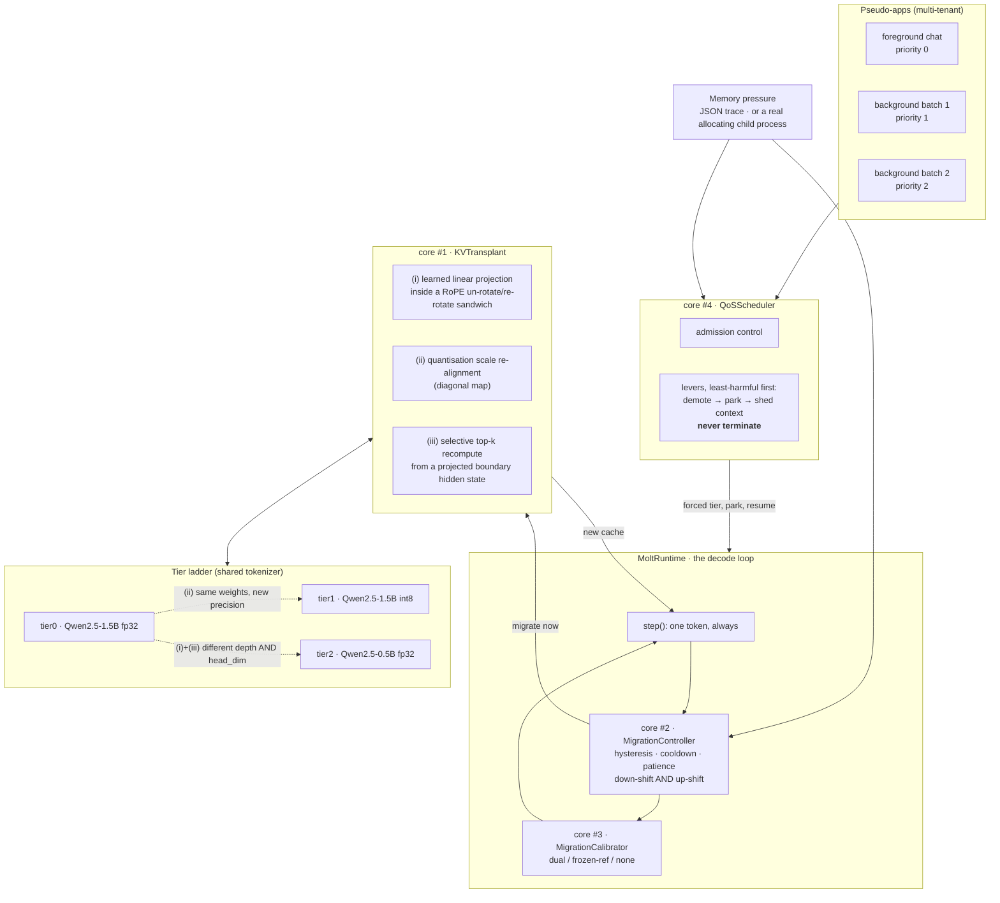
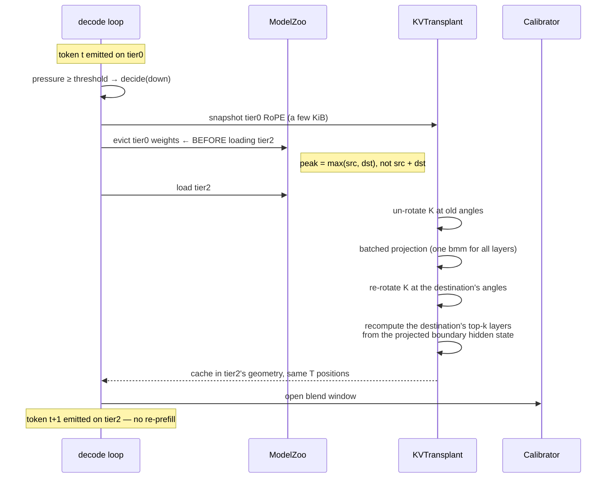

# Molt

> **Molt lets a running generation shed its model the way a crab sheds its shell.
> When the device runs out of memory, the KV cache — the animal — walks across to
> the next size down, and the token stream never stops.**


*A replay of a recorded session — every token, timestamp and migration cost comes
from the raw event stream (`artifacts/demo_session.json`). The budget is cut
mid-sentence and the paragraph keeps going on progressively smaller models.*

Molt is a research prototype for **elastic on-device inference**. A generation
that starts on a 1.5B model and hits a memory-pressure event mid-answer does not
get killed (the usual outcome), does not restart from the prompt (the usual
mitigation), and does not have to run on the small model from the beginning just
in case. It *migrates between two tokens*, carrying its attention state with it.

The claim being tested is narrow and falsifiable:

> Under a memory-pressure trace that reclaims a statically-large process, an
> elastic runtime that transplants the KV cache mid-generation can keep every
> generation alive with **no forced terminations**, at a **switch cost several
> times lower than restarting the request**, and without ever exceeding the
> memory budget.

Two things that claim deliberately does *not* say, because the measurements do
not support them:

- **Not "no stall at all".** The worst single token in a cold-start run is
  dominated by *loading the destination model*, which the restart baseline pays
  identically. What Molt removes is the re-prefill on top of it. The isolated
  KV-work comparison (both rungs warm) is in the cost-sweep table.
- **Not "free".** A transplanted cache produces a measurably rougher seam than a
  re-prefill does — the numbers are in the results table, and the trade-off is
  stated explicitly rather than buried.

---

## Contents

- [The problem](#the-problem)
- [Why request-boundary switching is not enough](#why-request-boundary-switching-is-not-enough)
- [Architecture](#architecture)
- [The four cores](#the-four-cores)
- [Results](#results)
- [Run it as a service](#run-it-as-a-service)
- [Quick start](#quick-start)
- [Repository layout](#repository-layout)
- [Honest limitations](#honest-limitations)

---

## The problem

On a phone or laptop, an LLM shares memory with everything else. When the
camera app launches, the OS wants memory back **now**. An inference process has
three conventional options, and all three are bad:

| option | what happens |
|---|---|
| hold the big model | the OS reclaims the process (jetsam). The answer is lost mid-sentence. |
| always run the small model | you survive, but every answer is worse — including the 99% of the time when there was no pressure at all. |
| switch models, restart the request | you survive, but the user watches a multi-second stall while the prompt is re-read, and any already-emitted text is either thrown away or awkwardly continued. |

Molt adds a fourth: **change the model between two tokens and take the KV cache
with you.**

---

## Why request-boundary switching is not enough

Every conventional elastic-serving stack picks a model *per request*. That is
fine when load varies between requests. It is useless here, and the reason is
structural rather than an implementation detail:

- **The pressure event does not respect your request boundaries.** A long answer
  takes tens of seconds. An app launch takes one. The spike lands *inside* the
  answer, and the next boundary is far away in the future.
- **Waiting for the boundary means dying at it.** Between the spike and the end
  of the answer, the process is holding a footprint the OS has already decided it
  cannot have.
- **Deciding pessimistically at the boundary means always being wrong.** If you
  pick the small model at request start "in case pressure arrives", you have paid
  the quality cost on every request to insure against a rare event.

`figures/request_boundary_gap.png` measures exactly this: the same Molt
machinery, restricted to switching only at request boundaries (condition
`D-reqbound`), against unrestricted Molt on the same trace.

```mermaid
gantt
    title The window in which a request-boundary policy is powerless
    dateFormat X
    axisFormat %s
    section Request
    long answer being generated        :active, req, 0, 48
    section Memory
    budget fine                        :done,   m1, 0, 8
    budget below what the big model needs :crit, m2, 8, 26
    budget recovers                    :done,   m3, 34, 14
    section Molt
    migrate down (between two tokens)  :milestone, 8, 0
    migrate down again                 :milestone, 20, 0
    migrate back up                    :milestone, 35, 0
    section Request-boundary policy
    can only act here                  :milestone, 48, 0
```



---

## Architecture



### What actually moves during a migration



The eviction-before-load ordering is possible only because a transplant needs
the source model's **RoPE parameters**, not its weights
(`molt/kv_transplant.py::TierRef`). Without that observation, every migration
would need headroom for two rungs at once — which is exactly the memory that is
missing at the moment pressure hits.

---

## The four cores

### 1 · `molt/kv_transplant.py` — KVTransplant

Moves a cache between rungs whose hidden size, head_dim, depth and weight
precision all differ.

**(i) Learned linear projection.** Per destination layer, an affine map
`[n_kv·head_dim]_src → [n_kv·head_dim]_dst`, plus a depth remap
(`build_layer_map`, linear in relative depth). Fitted offline by **closed-form
ridge regression** on a few thousand calibration tokens — no SGD, seconds to fit,
deterministic.

> **The detail nobody can skip.** HuggingFace caches keys *after* RoPE. Two rungs
> with different `head_dim` rotate by different angles, so no
> position-independent matrix can map one cache onto the other — the required map
> would depend on each token's absolute position. Molt therefore sandwiches the
> learned matrix between an **un-rotation at the source's angles** and a
> **re-rotation at the destination's**. `use_rope_realign=False` is shipped as an
> ablation, and it is much worse.

**(ii) Quantisation scale re-alignment.** When the rungs share weights and differ
only in precision, geometry is untouched and only per-channel scale/offset
drifts. That case gets a *diagonal* map — the same fitting code, a different
flavour, and it fits almost perfectly: **held-out residual k 0.013, v 0.028**.

**(iii) Selective top-k recompute.** The destination's final `k` layers are
recomputed *natively* rather than projected, starting from a projected
boundary hidden state (the runtime keeps a rolling trace of it, and the byte cost
is reported in the memory table). DroidSpeak does this for identically-shaped
siblings; the projected hidden state is what makes it work across *different
sizes*. Verified bit-exact against a full forward in
`tests/test_kv_transplant.py::test_partial_layer_recompute_is_exact`.

Every call returns a `TransplantReport` with wall-ms per phase, estimated FLOPs,
bytes in/out, and which mechanisms fired.

### 2 · `molt/migration.py` — MidStreamMigration

Decides *when* to switch, inside the token loop. Bidirectional: pressure recedes
→ the generation climbs back up, so a transient spike is not a permanent tax.
Three independent anti-thrash mechanisms (hysteresis band, cooldown, up-shift
patience) plus one that turned out to matter more than all of them:

> **An up-shift must be checked for *fit*, not just for pressure.** Hysteresis is
> about *time*; it cannot stop a controller from climbing onto a rung 2.5× its
> current size just because the pressure reading dipped. Without an affordability
> veto the controller oscillates — up-shift, breach, demote, repeat — and that
> oscillation was the single largest source of forced terminations during
> development.

Cooldown never outranks survival: a reading already over budget bypasses it.

### 3 · `molt/calibration.py` — MigrationCalibration

The incoming model inherits a cache it did not build. Even a good projection
leaves a step change in the output distribution, and the classic symptom follows:
the text starts repeating or changes register mid-sentence. Three modes:

- **`dual`** — the outgoing model stays alive for `blend_steps` tokens and the
  emitted distribution is a probability-space mixture with a cosine-annealed
  weight. Highest fidelity, but two models are momentarily resident.
- **`frozen_ref`** — no second model. The outgoing model's recent *entropy* is
  recorded before it is released and the incoming logits are temperature-rescaled
  so entropy interpolates instead of jumping. Costs one scalar bisection per
  token and **zero extra memory** — which is why `dual` automatically degrades to
  it under critical pressure. Continuity must never be bought with memory at the
  exact moment memory is short.
- **`none`** — the ablation the other two are measured against.

Measured by **handoff JSD**: at the switch point the outgoing model is asked for
its next-token distribution over the very position the incoming model is about to
answer, and the two are compared. That isolates the migration; see
[the discarded metrics](#three-metrics-that-had-to-be-thrown-away) for why the
obvious step-to-step measure does not work.

> **A negative-ish result worth stating.** On the real ladder, `dual` blending
> improves the seam only slightly over `none` — and it does so while holding two
> models resident, which shows up as roughly **1.9 GB of extra peak memory**
> in the results table. On a device whose entire problem is memory, that is a
> bad trade, and it is the reason `frozen_ref` exists: it moves entropy
> continuously toward the incoming model's own level for the price of one scalar
> bisection per token and **zero** extra bytes. The exact figures are in the
> `D` vs `D-nocal` rows.

### 4 · `molt/scheduler.py` — QoSScheduler

One foreground conversation and two background batch jobs share one budget. Four
levers, applied **synchronously and before anyone steps**, in order of increasing
harm: defer admission → demote → park (weights released, cache kept) → shed the
oldest context. Nothing is ever terminated.

Two findings that took real debugging:

- **Demote by group, not by tenant.** Moving *one* of three apps off a shared
  rung frees nothing (the rung stays resident for the others) while adding the
  destination's weights — usage goes *up*. Retiring the whole rung at once bounds
  the transient at `old + new` instead of growing with tenant count.
- **In multi-tenant mode the scheduler must be the only migration authority.**
  Three tenants each reacting to *global* pressure each load a destination rung
  while the others still hold the source; the transient sum is what kills the
  process. `Generation.self_migrate=False` under the scheduler.

---

## Results

Regenerate with `make bench && make figures`. The table below is written by
`figures/make_figures.py` straight from `benchmarks/results/summary.json`, so it
cannot drift from the measurements.

<!-- RESULTS_TABLE -->

| condition | kills | worst ITL (ms) | mean ITL (ms) | migrations | migration cost (ms) | handoff JSD | judge agree | accuracy | needle | peak MiB |
|---|--:|--:|--:|--:|--:|--:|--:|--:|--:|--:|
| A · Static-large | 5 | 246 | — | 0.0 | 0 | — | — | 0.00 | 0.00 | 5915 |
| B · Static-small | 0 | 80 | 58 | 0.0 | 0 | — | 0.750 | 0.67 | 1.00 | 1896 |
| C · Restart-on-pressure | 0 | 4528 | 655 | 2.2 | 3615 | 0.0386 | 0.975 | 1.00 | 1.00 | 5915 |
| D · Molt | 0 | 4586 | 606 | 2.2 | 900 | 0.2199 | 0.817 | 1.00 | 1.00 | 7802 |
| D⁻ · Molt, no calibration | 0 | 2561 | 567 | 2.2 | 755 | 0.2313 | 0.792 | 1.00 | 1.00 | 5918 |
| D⁻ · Molt, no learned projection | 0 | 3664 | 571 | 2.2 | 22 | 0.1917 | 0.717 | 1.00 | 1.00 | 7799 |
| D⁻ · Molt, no top-k recompute | 0 | 3708 | 664 | 2.2 | 29 | 0.2243 | 0.817 | 1.00 | 1.00 | 7799 |
| D⁻ · Molt, request-boundary only | 5 | 210 | — | 0.0 | 0 | — | — | 0.00 | 0.00 | 5918 |

| route | tokens | transplant (ms) | re-prefill (ms) | speed-up | FLOPs saved |
|---|--:|--:|--:|--:|--:|
| tier0->tier2 | 128 | 54.0 | 262.0 | 4.85x | 74% |
| tier0->tier2 | 256 | 93.0 | 414.9 | 4.46x | 74% |
| tier0->tier2 | 512 | 179.8 | 792.6 | 4.41x | 74% |
| tier0->tier2 | 1024 | 398.6 | 1745.9 | 4.38x | 74% |
| tier0->tier1 | 128 | 345.3 | 1696.4 | 4.91x | 79% |
| tier0->tier1 | 256 | 421.2 | 2069.2 | 4.91x | 79% |
| tier0->tier1 | 512 | 595.9 | 3013.3 | 5.06x | 79% |
| tier0->tier1 | 1024 | 984.7 | 4829.6 | 4.90x | 79% |

| QoS (3 tenants) | value |
|---|--:|
| forced terminations | 0 |
| max budget overshoot | -166.2 MiB |
| demotions / promotions | 6 / 3 |
| pauses / resumes | 3 / 3 |
| context sheds | 3 |
| deferred admissions | 0 |

<!-- /RESULTS_TABLE -->

Figures (all rendered from measured data by `figures/make_figures.py`):

| figure | claim |
|---|---|
| `figures/hero_latency_timeline.png` | **no-stall** — C's re-prefill spike vs D's bump, on the same trace |
| `figures/request_boundary_gap.png` | mid-stream migration is *necessary*, not merely nicer |
| `figures/migration_cost.png` | **low migration cost**, widening with context length |
| `figures/calibration_ablation.png` | **continuity** — blending vs switching cold |
| `figures/qos_timeline.png` | **zero-kill** — usage never crosses the budget, 3 tenants |
| `figures/survival_vs_quality.png` | the trade-off all four conditions span |
| `figures/ablations.png` | what each mechanism contributes |

---

## Run it as a service

The prototype ships a deployable face: a single-worker streaming server whose
elasticity is visible on the wire. Standard library only — no web framework.

```bash
python -m molt.service --ladder qwen --host 127.0.0.1 --port 8000
```

Then open `http://127.0.0.1:8000/` for the demo page (type a prompt, press
**Squeeze memory now** mid-answer, watch the token background colour change as
the stream continues on a smaller model), or drive it from the terminal:

```bash
python examples/client.py "Write a paragraph about a workshop." --squeeze-at 20
```

### API

| endpoint | purpose |
|---|---|
| `GET /health` | liveness, the ladder, the current budget |
| `GET /stats` | live footprint, resident rungs, migrations, and `kills` — the SLO |
| `POST /v1/generate` | non-streaming; returns the answer plus the migrations it took |
| `POST /v1/generate/stream` | server-sent events: one per token, each tagged with the rung that produced it, plus an explicit `migration` event |
| `POST /admin/pressure` | `{"budget_mb": 2400}` or `{"trace": "spike_mid_answer"}` |

A streamed answer looks like this — note that the switch is *in band*, so a
caller can render it rather than being surprised by it:

```json
{"type":"start","tier":"tier0","prompt_tokens":412,"ttft_ms":2870}
{"type":"token","text":" The","tier":"tier0","index":0}
{"type":"migration","from":"tier0","to":"tier1","method":"molt","cost_ms":812,"flops_saved":0.786,"pressure":1.31}
{"type":"token","text":" operating","tier":"tier1","index":8}
{"type":"done","tokens":120,"tiers":["tier0","tier1"],"migrations":1,"killed":false}
```

### A real transcript

Not a mock-up — this is `examples/client.py` against the service on the Qwen
ladder, CPU, with the budget cut to 2651 MiB eight tokens into the answer:

```
ladder qwen2.5-1.5b-ladder on cpu — Qwen2.5-1.5B (fp) → Qwen2.5-1.5B (int8) → Qwen2.5-0.5B (fp)
[start on tier0 · 17 prompt tokens · TTFT 3122 ms]
 An operating system reclaims memory from background
[budget cut to 2651 MiB]
 processes
⇄ tier0 → tier1 (molt, 260 ms, 79% FLOPs saved, pressure 0.81)
 to free up resources and improve system performance. When a process is no
 longer actively using memory, the operating system can reclaim that memory
 for other processes or applications
[done: 40 tokens in 37497 ms · rungs used tier0, tier1 · 1 migration(s) costing 260 ms · killed=False]
[server: 1 migrations, 0 forced terminations, peak 5890 MiB, wall 37.7s]
```

The sentence *"…reclaims memory from background processes to free up
resources…"* is written by two different models. The word before the switch and
the word after it are separated by a 260 ms migration and nothing else — no
re-prefill, no restart, no dropped connection.

### Operational contract

- **Nothing is ever killed.** `/stats` exposes `counters.kills` and
  `slo_zero_kill`. If that number is ever non-zero, the service has failed its
  only hard guarantee — alert on it.
- **Backpressure, not rejection.** A request that does not currently fit waits in
  the admission queue and receives a `queued` event explaining why. Returning
  `503` under memory pressure would reintroduce exactly the failure this project
  removes.
- **One inference worker.** Torch on CPU is not re-entrant over a shared KV cache
  and the memory accounting must be single-threaded to be true. HTTP threads only
  enqueue; the worker owns every model and every cache.
- **Swap in the platform's real signal.** `ManualPressure` implements the same
  `PressureSource` interface as the trace replayer, so wiring up macOS
  `memory_pressure`, Linux cgroup `memory.pressure_level`, or Android
  `onTrimMemory` is a one-file change and the scheduler cannot tell the
  difference.
- **Start-up checks the projectors.** A route with no trained map is reported at
  boot, not at the first pressure event.

### What is deliberately *not* production-grade

Stated plainly because a research prototype that pretends otherwise is worse than
one that does not: there is no authentication, no rate limiting, no request
tracing, no multi-process sharding, no batching across concurrent requests
(the worker is strictly serial), and no persistence. Those are ordinary
engineering, and none of them interact with the claims being tested.

---

## Quick start

Nothing here needs a GPU. The test-suite needs no downloads at all.

```bash
pip install -r requirements.txt
```

Works on **transformers 4.x and 5.x**. Molt reaches further into the library
than most code does — it builds KV caches by hand and runs individual decoder
layers — and v5 removed `from_legacy_cache`, dropped `cache_position` from the
layer signature, and renamed the causal-mask kwarg. `molt/_compat.py` inspects
each callable and passes only the arguments that exist, so there is no version
switch to keep updated. Verified identical behaviour on 4.57 and 5.16.

**Run the hermetic test-suite** (randomly-initialised tiny Qwen2 models,
structurally identical to the real ladder — different depth *and* different
head_dim — so the same code paths are exercised in seconds):

```bash
python -m pytest -q
```

**Fit the projectors, then run the full benchmark** on the real ladder
(Qwen2.5-1.5B fp32 / int8 / Qwen2.5-0.5B, CPU):

```bash
python scripts/train_projectors.py --ladder qwen --recompute-top-k 6
```

```bash
python benchmarks/run.py --ladder qwen --trace spike_mid_answer --conditions all --cost-sweep --qos
```

```bash
python figures/make_figures.py --results benchmarks/results --out figures
```

**Use a real memory hog** instead of the deterministic trace (spawns a child
process that actually allocates and touches pages):

```bash
python benchmarks/run.py --ladder qwen --trace spike_mid_answer --real-hog
```

**Sanity-check everything quickly** with the synthetic ladder (no downloads):

```bash
python benchmarks/run.py --ladder synthetic --projector-dir artifacts/proj_test --recompute-top-k 2 --virtual-step 1.2
```

### Benchmark conditions

| key | condition | what it is |
|---|---|---|
| `A` | Static-large | always tier0; exists to produce non-zero forced terminations |
| `B` | Static-small | always the cheapest rung; the quality floor Molt must beat |
| `C` | Restart-on-pressure | switches rungs, **discards** the cache, re-prefills |
| `D` | **Molt** | switches rungs, **transplants** the cache, calibrates the seam |
| `D-nocal` | ablation | core #3 removed |
| `D-noproj` | ablation | core #1(i) removed — truncated identity, no RoPE sandwich |
| `D-norecompute` | ablation | core #1(iii) removed — pure projection |
| `D-reqbound` | ablation | may only switch between requests |

All conditions share one runtime, one sampler, one stopwatch and one pressure
source, so the comparison is not between four implementations.

---

## Repository layout

```
molt/
  service.py       ★ the deployable face: streaming HTTP server + demo UI
  static/          the browser demo page
  config.py        tier ladders, knobs; DEFAULT/SYNTHETIC ladders
  adapters.py      arch-agnostic model access + the partial layer-range runner
  kv_cache.py      MoltCache: past_key_values as inspectable data + hidden traces
  projector.py     RoPE sandwich, LinearMap (dense/diag/identity), batched projection
  fit_projector.py closed-form ridge fitting of a route, one rung resident at a time
  kv_transplant.py ★ core #1 + TierRef (why the source can be evicted first)
  migration.py     ★ core #2 + the request-boundary straw man
  calibration.py   ★ core #3 (dual / frozen_ref / none)
  scheduler.py     ★ core #4 (admission, demotion, parking, context shedding)
  runtime.py       the decode loop; Policy = STATIC | RESTART | MOLT
  quantization.py  portable INT8/INT4 (+ bitsandbytes when CUDA is present)
  pressure.py      trace replay, virtual clock, real child-process hog
  pressure_hog.py  the child process
  metrics.py       TTFT/ITL, JSD discontinuity, memory probe, event log
benchmarks/
  run.py           the driver; conditions.py; quality.py; pressure_traces/*.json
figures/
  make_figures.py  every figure + the results table in this README
scripts/
  train_projectors.py
examples/
  client.py        streaming CLI client (stdlib only)
tests/             hermetic; one file per core, plus the service surface
Dockerfile         CPU image; weights and projectors are mounted, not baked
Makefile           install / test / projectors / bench / figures / serve
```

Every function's docstring names the claim it is evidence for
(**no-stall** / **low migration cost** / **continuity** / **zero-kill**), so any
number in the table can be traced back to the code that produced it.

---

## Honest limitations

These are real, and stating them is part of the result.

1. **The INT8 rung buys memory, not speed.** `bitsandbytes` is CUDA-only, so the
   portable fallback in `molt/quantization.py` dequantises on use. Prefill is
   slightly *faster* than fp32 (less memory traffic, dequant amortised over the
   batch) but single-token decode is ~4× slower, because dequantising a weight
   matrix to multiply it by one vector doubles the work. `torch._weight_int8pack_mm`
   was measured and was slower still on this host. A tuned kernel (or CUDA
   bitsandbytes, or Apple's ANE) removes this; the memory result stands either way.
2. **The V-map is the weak projection.** Held-out residuals on the real ladder,
   1.5B→0.5B: key **0.185**, value **0.424**, boundary hidden state **0.077**.
   Up-shifts are harder still (key 0.295, value 0.604) because the map is
   expanding rather than contracting. Most of the remaining post-migration
   discontinuity lives in the value map. Per-head maps, or a low-rank non-linear
   map, are the obvious next things to try.
3. **Cross-*family* migration is not supported.** Every rung must share a
   tokenizer; `assert_ladder_compatible` refuses otherwise. Token ids have to mean
   the same thing on both sides of a mid-stream switch.
4. **The budget is simulated by default.** `TraceReplaySource` is a model of
   memory pressure, chosen for reproducibility. `--real-hog` runs a real
   allocating child process and reads real availability via `psutil`; it is
   slower and noisier, and the numbers in the table are the deterministic ones.
5. **`peak_transient_mb` is reported separately from `peak_mb`.** During a grouped
   demotion two rungs are briefly resident. The no-kill invariant is enforced at
   step boundaries; a maximally aggressive jetsam could in principle fire inside
   that window. The number is printed rather than hidden.
6. **The ladder is Qwen2.5, not Llama-3.2.** Llama-3.2 is gated on the Hub. The
   Qwen2.5 instruct family has the structural properties the experiment needs —
   1536 vs 896 hidden, 28 vs 24 layers, head_dim 128 vs 64, one shared tokenizer —
   so both the same-shape (quantisation) and different-shape (cross-size) routes
   are exercised. `--ladder qwen-3b` adds a 3B top rung if you have the disk.
7. **Not modelled, on purpose.** Multi-node / server-side cache sharing
   (DroidSpeak-style) and weight streaming from flash (LLM-in-a-Flash-style) are
   explicitly out of scope, per the project constraints: this is about on-device
   multi-tenancy and mid-generation migration.
8. **CPU first.** NPU / CoreML / Metal paths are deliberately unoptimised; the MPS
   backend is supported but measured slower than CPU for these model sizes.

---

## Provenance of every claim

| claim | enforced by | measured by | test |
|---|---|---|---|
| **no-stall** | `Generation.step` emits a token in the same call as a migration | per-token ITL series, stall count | `test_generation_continues_across_migrations`, `test_a_squeeze_mid_answer_migrates_without_dropping_the_stream` |
| **low migration cost** | `KVTransplant` (projection + top-k recompute) | `TransplantReport.wall_ms` / FLOPs vs `reprefill` | `test_transplant_is_cheaper_than_reprefill`, `test_transplant_cost_grows_slower_than_reprefill` |
| **continuity** | `MigrationCalibrator` + fitted projector | **handoff JSD** (below), judge agreement, 3-gram repetition | `test_calibration_reduces_the_distribution_jump`, `test_fitted_projector_beats_the_naive_map` |
| **zero-kill** | `MemoryBroker.check` + `QoSScheduler.enforce` | forced terminations, `max_overshoot_mb` | `test_no_kills_under_every_builtin_trace`, `test_zero_kills_and_no_overshoot` |

### What each mechanism actually contributed

Removed one at a time, same trace, same prompts. Two of these results argue
*against* parts of the design, and they are stated first because an ablation
table that only ever confirms the design is not an ablation table.

| removed | judge agreement | judge ppl | handoff JSD | switch cost | verdict |
|---|--:|--:|--:|--:|---|
| nothing (full system) | **0.817** | **3.09** | 0.220 | 900 ms | — |
| learned projection + RoPE sandwich | 0.717 | 24.14 | *0.192* | 22 ms | **essential** |
| logit blending | 0.792 | 3.69 | 0.231 | 755 ms | helps, but costs ~1.9 GB in `dual` |
| top-k native recompute | 0.817 | 3.21 | 0.224 | **29 ms** | **not worth it here** |
| the ability to switch mid-stream | — | — | — | — | **essential** (killed 5/5) |

- **The learned projection is doing the work.** Without it, judge perplexity goes
  from 3.09 to **24.14** and agreement falls to 0.717 — below the always-small
  baseline. The naive "just reshape the tensors" map is not a viable shortcut.
- **…and it is also the case that raw handoff JSD says the opposite** (0.192 for
  the naive map versus 0.220 for the fitted one). That is not a contradiction, it
  is a property of the metric: Jensen–Shannon divergence is bounded and *rewards
  blurring*, so a map that degrades the cache into a flat distribution scores a
  lower one-shot divergence while the text falls apart a few tokens later.
  `scripts/diagnose_projection.py` measures the mechanism directly, and it is not
  subtle:

  | 1.5B→0.5B map | K recon. error | V recon. error | attention entropy vs native |
  |---|--:|--:|--:|
  | fitted (ridge) | 0.196 | 0.465 | **1.50×** |
  | truncated identity | 1.308 | 2.173 | **11.36×** |

  A reconstruction error above 1.0 means the naive map's cache is *worse than
  predicting zeros*, and the attention it induces is eleven times flatter than
  the destination model's own. That flatness is the blur that flatters its JSD.
  Handoff JSD measures the **seam**; it does not measure transplant quality on
  its own, which is why it is always reported next to judge agreement here.
- **The top-k recompute did not earn its cost at this setting.** `k = 6` of 24
  layers bought a 2% better seam and no measurable change in agreement, for
  **31× the switch cost** (900 ms against 29 ms). On this ladder the honest
  recommendation is `--recompute-top-k 0`; the mechanism is retained because it
  is exact (verified bit-identical to a full forward) and because the trade
  should shift on ladders with a larger quality gap between rungs.

### Three metrics that had to be thrown away

Reported because the discarded ones are as informative as the kept ones.

1. **Step-to-step "excess JSD" does not measure continuity on real text.**
   The original continuity metric was `JSD(p_t, p_{t-1})` around the switch minus
   its steady-state value. On Qwen2.5 the steady state measured **0.65–0.69
   nats** — against a theoretical maximum of `ln 2 ≈ 0.693`. Consecutive
   positions in natural language predict genuinely different things, so the
   quantity is saturated and a migration's contribution is far below the floor;
   the measured "excess" came out *negative* for several arms. Replaced by
   **handoff JSD**: at the switch point the outgoing model is asked for its
   distribution over the *same* position the incoming model is about to answer,
   and the two are compared directly. Condition C (re-prefill) supplies the
   floor — the irreducible "these are two different models" disagreement — that
   a transplant should be judged against, rather than against zero.
2. **Judge perplexity is not a quality ranking.** Degenerate repetition is
   highly predictable and scores *well*. It is still reported, but always beside
   `judge_agreement` (does the good model's argmax match the emitted token?),
   `repetition_rate` and `distinct_2`.
3. **The first needle task measured nothing.** "The code is 7413 … what is the
   code?" scored 1.00 for every condition, including the ones that were
   reclaimed mid-answer: the answer sits in the prompt, so any model that copies
   wins. The suite now plants competing distractors and asks a question that
   selects among them, and a killed generation scores 0 instead of dropping out
   of the average.
